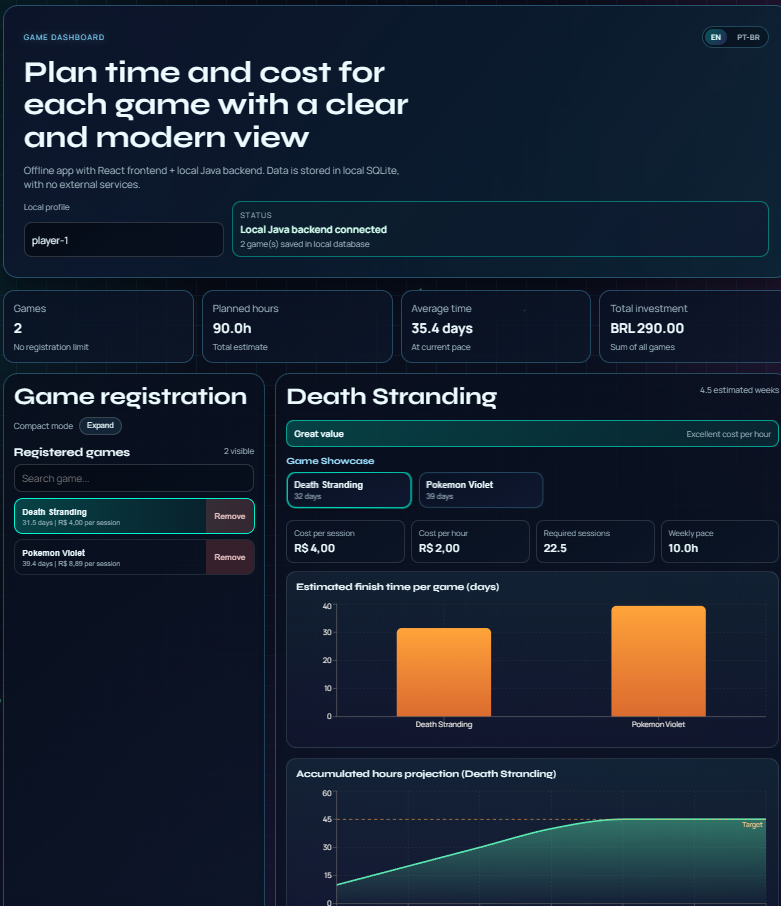
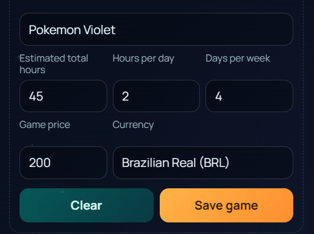
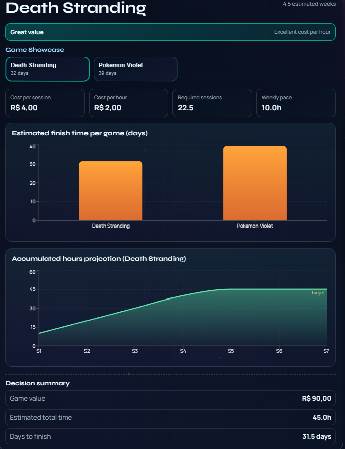
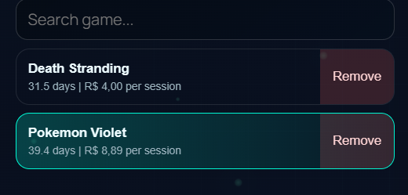

# Game Dashboard 2.0

Local/offline dashboard with React frontend, Java backend (Spring Boot), and SQLite.

## Recommended Flow

1. Run the installer once:

```bash
python install_app.py
```

2. Start the application:

```bash
python start_app.py
```

You can also launch it using the desktop shortcut/launcher created by the installer.

## Command Variations by System

Windows PowerShell:

```powershell
python .\install_app.py
python .\start_app.py
```

Windows CMD:

```bat
python install_app.py
python start_app.py
```

If `python` is not available on Windows:

```bat
py -3 install_app.py
py -3 start_app.py
```

Linux/macOS (bash/zsh):

```bash
python3 install_app.py
python3 start_app.py
```

## What `install_app.py` Does

- Detects the operating system.
- Checks dependencies: `java`, `mvn`, `node`, `npm`.
- Optionally installs missing dependencies automatically (`--auto-install`).
- Runs `npm install` in the frontend.
- Validates backend with `mvn test` (optional skip with `--skip-tests`).
- Creates a desktop launcher/shortcut.
- Optionally starts the app immediately (`--run-now`).

Useful options:

```bash
python install_app.py --auto-install
python install_app.py --skip-tests
python install_app.py --run-now
```

## What `start_app.py` Does

- Starts local Java backend (port `8080`) if not already running.
- Starts local React frontend (port `5173`) if not already running.
- Opens the app automatically at `http://127.0.0.1:5173`.

Generated logs at repository root:

- `backend.log`
- `frontend.log`

## Application Screenshots









## Architecture

- Java backend: `src/main/java/com/nicholas/gamedashboard`
- React frontend: `frontend/`
- Local database: `game-dashboard.db` (SQLite)

## Environment Variables

Backend:

- `RAWG_API_KEY` (optional)

Frontend (`frontend/.env`):

- `VITE_API_BASE_URL=http://localhost:8080/api/v1`

## Main Endpoints

- `GET /api/v1/dashboard/summary`
- `GET /api/v1/goals`
- `POST /api/v1/goals`
- `PUT /api/v1/goals/{goalId}`
- `DELETE /api/v1/goals/{goalId}`

## Production Build

```bash
mvn clean package
cd frontend && npm run build
```
